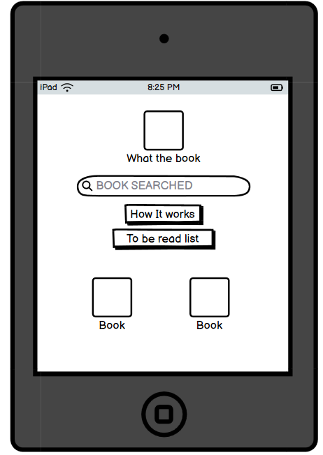
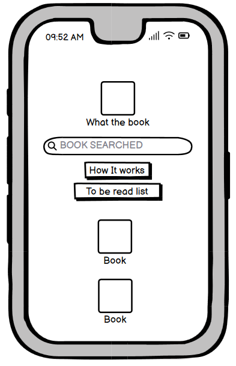

# What the Book

:computer: View the live site **[here](https://hgwhitfield.github.io/what-the-book/)**

**"What the Book"** is an engaging, user-friendly website dedicated to book enthusiasts everywhere. This digital haven serves as a dynamic platform for book lovers to discover, explore, and organize their next great reads. Designed with simplicity and accessibility in mind, **"What the Book"** ensures that users of all ages and technical abilities can easily navigate through its features.

The website is designed to be a functional, streamlined web app. The central feature is the book search tool, allowing users to find books by title, author, or ISBN effortlessly. Each search result can we saved to the 'To Be Read' list which can be accessed later, allowing it to act as the online home for all the books a user may wish to read in the future.

## Table of Contents

- [About the Website](#about-the-website)
  - [Target Audience](#target-audience)
  - [User Requirements and Expectations](#user-requirements-and-expectations)
  - [User Stories](#user-stories)
  - [UX Design Goals](#ux-design-goals)
  - [UX Design Documentation](#ux-design-documentation)
- [Features](#features)
  - [Current Features](#current-features)
  - [Future Features](#future-features)
- [Technology](#technology)
- [Deployment](#deployment)
  - [Via Gitpod](#via-gitpod)
  - [Via GitHub Pages](#via-github-pages)
- [Testing](#testing)
- [Testing Documentation](testing.md)

## About the Website

- **Discover Books**: The search tool enables users to find a wide range of books, complete with cover images, author details, and book summaries.
- **Organize Your Reads**: The "To Be Read" (TBR) list functionality allows users to save and manage books they wish to read in the future. This feature is designed to be intuitive and easily accessible, ensuring users can keep track of their reading goals.
- **Interactive Experience**: Clicking on a book takes users directly to its detailed page on Google Books, providing further information and purchase options.

### Target Audience

The target audience of **"What the Book"** includes book enthusiasts of all ages, from casual readers to avid literature enthusiasts. This web app is designed to cater to individuals who enjoy discovering new books, organizing their reading lists, and keeping track of their reading goals. It is suitable for anyone looking for an efficient, simple, and enjoyable way to find their next great read and maintain their 'to be read' lists. The website's user-friendly design ensures accessibility for users of all technical abilities, making it a welcoming platform for both the tech-savvy and those less familiar with digital tools.

### User Requirements and Expectations

- **Simple and Intuitive User Interface:** The interface should be clean and easy to navigate, allowing users to find what they need without confusion.
- **Seamless Navigation:** Users should be able to move through the website's features smoothly, with clear paths to different sections such as search, TBR list, and book details.
- **Clear Presentation of Content:** Information should be displayed in a straightforward and visually appealing manner, making it easy for users to understand and engage with.
- **Fun and Engaging Experience:** The app should provide an enjoyable experience that encourages users to explore and utilize its features.
- **Responsive Design:** The website should be fully functional and visually appealing on various devices, including desktops, tablets, and smartphones.
- **Expandable Features:** The design should allow for future additions and enhancements, such as personalized recommendations, user reviews, and social interactions.
- **Modern and Professional User Experience:** The site should maintain a modern and professional look, ensuring a high-quality user experience that feels sleek and efficient.

### User Stories

#### First-Time Visitors

As a first-time visitor, I want:

- To understand the purpose of the site easily to determine if it suits my needs.
- To navigate the website easily to find information about books and how to use the site.
- To search for books by title, author, or ISBN using a simple search tool.

#### Returning Users

As a returning user, I want:

- To quickly access my To Be Read (TBR) list to manage my saved books.
- To perform book searches efficiently to discover new reads.
- To receive updates and new features that enhance my user experience.

#### User

As a user, I would like:

- To search for books by title, author, or ISBN using a simple search tool.
- To view detailed information about each book, including cover images, authors, and summaries.
- To add books to my TBR list and manage this list easily.
- To navigate through the website smoothly without encountering any technical issues.
- To have a consistent and reliable experience across different devices.
- To explore additional features in the future, such as personalized recommendations and social interactions.

### UX Design Goals

The primary goals when developing **"What the Book"** were to create a simple, slick, and straightforward web app that provides an efficient and enjoyable user experience. The design focuses on clarity, ease of use, and visual appeal, ensuring that users can find and organize their books effortlessly. With the scope for future enhancements, the platform aims to grow and adapt to the evolving needs of its users, making it a valuable tool for book lovers everywhere.

## UX Design Documentation

### 1. Introduction

The primary goal of the UX design process for **"What the Book"** was to create a simple, intuitive, and engaging web application that allows users to discover, explore, and organize their next great reads. The vision was to provide a seamless experience where book lovers could manage their To Be Read (TBR) lists efficiently, eliminating the need for notes on their phones or scattered lists. The web app was designed to be scalable, with the potential to evolve into a standalone application in the future.

### 2. Research and Planning

The research phase involved understanding the needs and preferences of book enthusiasts. We conducted surveys and interviews with potential users, which provided insights into their reading habits and how they currently manage their TBR lists. Analyzing competitor websites and apps helped us identify common features and areas for improvement. The planning phase focused on defining the core functionalities and ensuring that the design would be user-centric and adaptable for future enhancements.

### 3. Wireframes

Wireframes were created to outline the basic structure and layout of the website. These wireframes focused on the placement of key elements such as the search bar, book results, and the TBR list. The goal was to ensure a logical flow of information and ease of navigation. Wireframes also helped in visualizing the user journey from discovering a book to adding it to the TBR list.

**Example Wireframes:**
- 
- 
- 

- 
- 
- 

- 
- 
- 

- 
- 
- 

### 4. Mock-ups and Prototypes

High-fidelity mock-ups were developed based on the wireframes. These mock-ups incorporated the chosen colour palette and visual style, making the design visually appealing without being overwhelming. The mock-ups were used to gather feedback from stakeholders and users, allowing us to iterate and refine the design.

**Example Mock-up:**
- 

### 5. Colour Scheme and Inspiration

The colour palette for **"What the Book"** was chosen to evoke a sense of nostalgia and warmth associated with literature. The mid-century modern colour palette was selected to give the app a retro yet timeless feel, making it inviting and enjoyable to use.

### 6. Typography

The typography for **"What the Book"** uses the Chivo font, which was chosen for its readability and modern aesthetic. Chivo's clean and contemporary look complements the mid-century modern colour palette, contributing to the overall inviting and user-friendly design of the web app.

### 7. Design Implementation

The design elements from the wireframes and mock-ups were implemented in the final website. Challenges such as ensuring responsiveness and cross-browser compatibility were addressed during the development phase. The website was designed to be a web app, with features and functionalities that could be easily transitioned into a standalone mobile app in the future.

### 8. Reasoning and Justification

The design choices were made to enhance user engagement and ensure a straightforward navigation experience. The chosen colour palette and visual style aimed to create a fun yet sophisticated atmosphere. The prominent search bar encourages users to start exploring books immediately, while the TBR list provides an easy way to organize future reads. The clean and simple interface ensures that users of all ages and technical abilities can navigate the app effortlessly.

### 9. Conclusion

The UX design process for **"What the Book"** was thorough and iterative, ensuring that each design decision was user-centric and aligned with the project's goals. The result is a seamless and engaging web app that meets the needs of book lovers. Future improvements will focus on adding user accounts, personalized recommendations, user reviews, and social features based on user feedback.

## Features

Here is a list of the features that are currently implemented on the website as well as plans for future features:

### Current Features

#### Logo

- The large "What The Book" logo prominently displayed on the homepage serves as a welcoming emblem for book lovers.
- Clicking on the logo conveniently brings users back to the homepage, ensuring easy navigation and a home base for visitors to return.

#### Search Bar and Function

- **Search Bar:** Located at the top of the homepage, the search bar allows users to find books by title, author name, or ISBN.
- **Search Function:** Users can type in their query and hit Enter or click the search icon. The results are displayed with book covers, titles, and authors.

#### Add to TBR List

- **Add to TBR Button:** Each book in the search results has an "Add to TBR" button. Clicking this button adds the book to the user's personal To Be Read (TBR) list, which is stored locally in the browser.
- **Added Indicator:** Books that have already been added to the TBR list are indicated by the button turning green and displaying "Added."

#### TBR List Modal

- **TBR List:** The "To Be Read List" button opens a modal displaying all the books the user has added to their TBR list. Each entry includes the book cover, title, and author.
- **Remove Button:** Users can remove books from their TBR list by clicking the "Remove" button under each book in the TBR list.

#### Book Details and Google Books Integration

- **Book Details:** Clicking on a book cover or title in the search results or TBR list opens a new tab with more details about the book on Google Books. This feature allows users to explore additional information and purchase options on Google Books.

#### How It Works Modal

- **Informative Text:** The "How It Works" button opens a modal that provides detailed information on how to use the website, including how to search for books, add them to the TBR list, and view or remove books from the TBR list.
- **Social Media Links:** At the bottom of the "How It Works" modal, there are links to the website's social media pages. Users can click these links to open the social media pages in a new tab.

#### Local Storage Integration

- **Persistent TBR List:** The TBR list is stored locally in the user's browser, so their saved books persist between sessions without needing to log in.

#### Responsiveness and Accessibility

- **Responsive Design:** The website is designed to be fully functional and visually appealing on various devices, including desktops, tablets, and smartphones.
- **Accessible Design:** Efforts have been made to ensure the site is accessible, including alt text for images and ARIA labels for buttons.

### Future Features

- **Button Improvements:** First update will make adding and removing from the list more intuitive. You won't have to go into the TBR list to remove a book; you will be able to remove it from search.
- **Enhanced TBR Management:** Future updates will include features to categorize and prioritize books within the TBR list.
- **Personalized Recommendations:** Integration of personalized book recommendations based on user preferences is a desired end goal.
- **User Reviews and Ratings:** Allowing users to leave reviews and ratings for books they have read.
- **Social Features:** Implementing social features that enable users to share their reading lists and favorite books with friends.

## Technology

1. **HTML:** Used to create the structure and content of the website.
2. **CSS:** Applied to style the website and its content, ensuring a visually appealing and consistent design.
3. **JavaScript:** Used to add interactivity and dynamic features to the website, including the search functionality and TBR list management.
4. **[Git:](https://git-scm.com/)** Utilized for version control to track changes and manage the codebase effectively.
5. **[Gitpod:](https://www.gitpod.io/)** Used as the integrated development environment (IDE) for coding, ensuring a seamless development process.
6. **[GitHub:](https://github.com/)** To store, host, and deploy the website, providing a platform for version control and collaboration.
7. **[Balsamiq:](https://balsamiq.com/)** Used to create wireframes for the design process, helping to visualize the layout and structure before implementation.
8. **[Bootstrap:](https://getbootstrap.com/)** Utilized for the grid system and some of the 'card' features, ensuring a responsive and flexible design.
9. **[Google Fonts:](https://fonts.google.com/)** Used for the typography on the site, specifically the Chivo font for a clean and modern aesthetic.
10. **[Font Awesome:](https://fontawesome.com/)** For the icons on the site, providing a wide range of scalable vector icons.
11. **[Google Books API:](https://developers.google.com/books/docs/overview)** Utilized to fetch book data, enabling users to search for books and view detailed information.
12. **[Jest:](https://jestjs.io/)** A testing framework for JavaScript, used to write and run tests ensuring the functionality and reliability of the code.
13. **[ChatGPT:](https://chat.openai.com/)** Utilized for troubleshooting code and as a starting point for text content, providing assistance and guidance throughout the development process.

## Deployment

### Via Gitpod

The project was successfully deployed using Gitpod. Here's how you can deploy your project on Gitpod:

- Navigate to GitHub and find the repository you want to deploy using Gitpod.
- Click on the "Gitpod" button, which you can find on the top right section of your repository page.
- This action will initiate a new workspace in Gitpod for the project.
- Within the Gitpod workspace, open the Terminal and execute the command *python3 -m http.server*.
- Shortly after, a blue notification will appear at the bottom right corner, offering options to either make the server public, preview it, or open it in a browser.

### Via GitHub Pages

The project was also deployed on GitHub Pages. To deploy your project on GitHub Pages, follow these steps:

- Sign into your GitHub account and select the repository intended for deployment to GitHub Pages.
- Navigate to the repository's "Settings" by clicking the button located on the top right corner of the repository section.
- On the Settings page, scroll down until you find the "GitHub Pages" section in the left-hand menu.
- In the "Source" section, click on the dropdown menu labeled "Branch" and change it from "None" to "Master".
- The website will refresh automatically, and the deployment link will be displayed at the top of the GitHub Pages section.

## Credits

- I took inspiration from the Goodreads website and my own desire for a easier to use simpler version of this site.
- Cassie by Designs a local graphic designer for helping with the design and creation of the svg assets for the site.
- Rohit Sharma my mentor for his generous giving of time for feedback and help planning.
- Youtube user name, Shanjai Raj. For the google books api video which was a good jumping off point when starting and showed me it was possible to implement my idea. 

## Testing

### Principles of Automated and Manual Testing

Automated testing involves using software tools to run tests on the application code to check for functionality, performance, and other aspects. It's efficient for repetitive tasks, regression testing, and running large test suites. Manual testing involves human testers who interact with the application to identify issues and ensure it works as expected. It's useful for exploratory testing, usability testing, and cases where human judgment is required.

### Test Procedures

During the development and implementation stages, both automated and manual test procedures were applied to ensure that the deployed version matched the development version. Automated tests were run using Jest to validate functionality and performance, while manual tests were conducted to verify usability and responsiveness.

### Conclusion

Automated and manual testing ensured that the **"What the Book"** web application functions correctly and meets the specified requirements. The tests covered key functionalities, including searching for books, adding books to the TBR list, and displaying the TBR list. Future improvements to the tests and the application will help maintain the quality and reliability of the application as new features are added.

For more detailed information on testing, please refer to the [Testing Documentation](TESTING.md).
