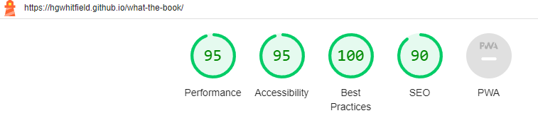

# Testing Documentation

Return back to the [README.md](README.md) file.

This section provides evidence demonstrating that:
- The project features function as expected.
- Users can successfully achieve their intended goals.
- The project is responsive across different device and screen sizes.
- The project is compatible with different types of web browsers.
- The project adheres to valid coding standards.
- The project passes audits for performance, accessibility, best practices, and SEO (using Lighthouse in Chrome Developer Tools).

## Table of Contents

- [Code Validation](#code-validation)
  - [HTML](#html)
  - [CSS](#css)
  - [JavaScript](#javascript)
- [Supported Screens and Browsers](#supported-screens-and-browsers)
  - [Supported Screens](#supported-screens)
  - [Supported Browsers](#supported-browsers)
- [User Stories Manual Testing](#user-stories-manual-testing)
  - [First-Time User Goals](#first-time-user-goals)
  - [Returning User Goals](#returning-user-goals)
  - [Additional Manual Tests](#additional-manual-tests)
- [Automated Testing](#automated-testing)
  - [Setting Up Jest](#setting-up-jest)
  - [Tests Included](#tests-included)
  - [Running the Tests](#running-the-tests)
  - [Test Results](#test-results)
  - [Conclusion](#conclusion)
- [Lighthouse Audit](#lighthouse-audit)
  - [Mobile Lighthouse Audit](#mobile-lighthouse-audit)
  - [Desktop Lighthouse Audit](#desktop-lighthouse-audit)
  - [Future Improvements](#future-improvements)
- [Fixed Bugs](#fixed-bugs)

## Code Validation

### HTML

- I have used the [HTML W3C Validator](https://validator.w3.org) to validate the HTML.

### CSS 

I have used the W3 [CSS Jigsaw Validator](https://jigsaw.w3.org/css-validator) to validate my CSS file.

### JavaScript

I have used the recommended [JS Hint](https://jshint.com/) to validate my JavaScript.

Note on JSHint testing: The JavaScript code for this project was tested using JSHINT to ensure code quality and adherence to best practices. During the testing, a warning was noted for the `module` variable being undefined. This warning appears due to the inclusion of module exports for testing purposes. This was resolved with the inclusion of `/* global module */` in the `app.js` file.

## Supported Screens and Browsers

The website underwent extensive testing on a diverse array of devices to ensure optimal responsiveness and compatibility, utilizing Google Developer Tools for precise emulation. The testing covered a wide spectrum of devices, including various models from leading brands and specific devices known for unique screen sizes or operating systems. Here's a condensed list, categorized by brand and device type for clarity:

### Supported Screens

#### Samsung Galaxy Series:

- Galaxy S3, S8, S9 Plus, S20 Ultra 
- Note 2, Note 3 
- A51
- Galaxy Tab S4
- Galaxy Fold

#### Apple Devices:

- iPhones: iPhone 4, SE (1st gen), 6, 7, 8, X, XR, 12 Pro, 14 Pro Max
- iPads: iPad, iPad Air, iPad Pro

#### Google Devices:

- Pixel 3, 3 XL, 4, 5
- Nexus 7, 10

#### Nexus Phones:

- Nexus 4, 5, 5X, 6, 6P

#### Blackberry Devices:

- Blackberry Z30
- Blackberry PlayBook

#### Amazon Devices:

- Kindle Fire HDX

#### LG Phones:

- LG Optimus L70

#### Microsoft Devices:

- Surface Pro 7
- Surface Duo

#### Motorola Phones:

- Moto G4

#### Nokia Phones:

- Lumia 520
- N9

#### Smart Displays:

- Nest Hub
- Nest Hub Max

### Supported Browsers

To ensure broad compatibility and optimal performance, the website was tested on the following web browsers:

- Google Chrome
- Safari
- Microsoft Edge
- Opera
- Brave
- Mozilla Firefox

## User Stories Manual Testing

### First-Time User Goals

| Feature | Expectation | Action | Result |
| --- | --- | --- | --- |
| **Understand the purpose of the site** | The purpose of the site is clear and the navigation is intuitive. | Open the homepage and click the prominent How It Works button. | Within one click, all easy-to-follow information about the site is provided from the informative modal. [PASS] |
| **Navigate the website** | Navigation is smooth and all links are functional. | Navigate through different sections using the navbar and buttons. | All sections are accessible and links work correctly. [PASS] |
| **To search for books by title, author, or ISBN** | Search bar is prominent on the home page. | Open the site and see the search bar straight away, use it to perform a search. | The search bar works as expected and the search results are provided. [PASS] |

### Returning User Goals

| Feature | Expectation | Action | Result |
| --- | --- | --- | --- |
| **See previously added books** | The previously added book remains in the TBR list. | Add a book to the TBR list, refresh the page, and check the TBR list. | Book persists in the TBR list after refreshing. [PASS] |
| **Search for new books** | New books can be searched and added to the TBR list successfully. | Use the search bar to find and add a new book. | New books can be searched and added successfully. [PASS] |
| **Remove books from TBR list** | Books can be removed from the TBR list. | Remove a book from the TBR list. | Book is successfully removed from the TBR list. [PASS] |

### Additional Manual Tests

| Feature | Expectation | Action | Result |
| --- | --- | --- | --- |
| **Click on a book for more information** | Clicking a book opens the correct Google Books page in a new tab. | Search for a book and click on it. | The book link opens the correct Google Books page. [PASS] |
| **View "How It Works" modal** | The "How It Works" modal provides clear instructions and functional social media links. | Click the "How It Works" button. | The modal provides comprehensive instructions for using the site. Social media links open in a new tab correctly. [PASS] |
| **Indicate already added books** | The "Add to TBR" button indicates the book is already in the TBR list. | Add a book to TBR and search for it again. | Button correctly shows "Added". [PASS] |

## Automated Testing

Automated testing was implemented to ensure the reliability and functionality of the **"What the Book"** web application. The tests were written using Jest, a JavaScript testing framework, and covered various aspects of the application to ensure it meets the specified requirements.

### Setting Up Jest

To set up Jest for automated testing, the following dependencies were installed:

- jest
- jest-environment-jsdom
- jest-fetch-mock
- @testing-library/dom

These dependencies are necessary for running the tests and mocking the fetch API used in the application.

### Tests Included

The following tests were included in the `app.test.js` file to cover different functionalities of the application:

| Functionality       | Test Description                       | Expectation                                  | Action                                                          | Result                                           | Status |
|---------------------|----------------------------------------|----------------------------------------------|-----------------------------------------------------------------|--------------------------------------------------|--------|
| **Search Books**    | Alerts if search term is empty         | An alert is displayed when the search input is empty | Simulate an empty search input and call the `searchBooks` function | The alert is displayed correctly                 | PASS   |
|                     | Fetches and displays results           | The search results are fetched and displayed correctly | Mock a fetch response and call the `searchBooks` function        | The search results are displayed correctly       | PASS   |
|                     | Handles invalid data from API gracefully | The application handles missing data gracefully | Mock a fetch response with missing data and call the `searchBooks` function | The search results display "undefined" for missing data fields | PASS   |
| **Add to Favorites**| Adds a book to TBR list                | The book is added to the TBR list            | Simulate adding a book to the TBR list                          | The book is added to the TBR list and the button state is updated | PASS   |
|                     | Prevents duplicate books in TBR list   | Duplicate books are not added to the TBR list | Simulate adding the same book twice to the TBR list              | The book is added only once to the TBR list      | PASS   |
| **Display TBR List**| Displays the TBR list                  | The TBR list is displayed correctly          | Simulate adding books to the TBR list and call the `displayTBRList` function | The TBR list is displayed correctly              | PASS   |
|                     | Displays an empty list when there are no TBR items | An empty TBR list is displayed              | Call the `displayTBRList` function with an empty TBR list       | The TBR list is empty                            | PASS   |

### Running the Tests

To run the tests, execute the following command in the terminal:

*npm test*

### Test Results

Here is a screenshot of the tests passed:

### Conclusion

Automated testing using Jest has helped ensure that the **"What the Book"** web application functions correctly and meets the specified requirements. The tests cover key functionalities, including searching for books, adding books to the TBR list, and displaying the TBR list. Future improvements to the tests and the application will help maintain the quality and reliability of the application as new features are added.

## Lighthouse Audit

Lighthouse is an open-source, automated tool for improving the quality of web pages. It audits web pages for performance, accessibility, best practices, SEO, and more. We have used Lighthouse to ensure that **"What the Book"** provides a high-quality user experience across both mobile and desktop platforms.

### Mobile Lighthouse Audit

Here is the Lighthouse audit report for the mobile version of the website. The audit includes scores for performance, accessibility, best practices, and SEO.

### Desktop Lighthouse Audit

Here is the Lighthouse audit report for the desktop version of the website. The audit includes scores for performance, accessibility, best practices, and SEO.

### Future Improvements

To further improve the Lighthouse scores and overall user experience, we plan to address the following issues:
- **Colour Contrast:** Enhance the colour contrast for elements related to the TBR list button to ensure better readability and accessibility.
- **SVG Logo Optimisation:** Optimise the logo image for better performance and rendering on mobile devices.

By implementing these improvements, we aim to provide an even better experience for our users, ensuring that the site is accessible and performant across all devices.

## Fixed Bugs

During the development of **"What the Book"**, several bugs were identified and resolved to ensure a seamless user experience. Below are some of the notable bugs and their fixes:

### 1. Button State Persistence

**Bug:** The "Add to TBR" button did not retain its "Added" state upon refreshing the page.

**Fix:** Implemented local storage to save the state of the TBR list. The button state is now correctly retrieved from local storage when the page is reloaded.

### 2. Cross-Origin Resource Sharing (CORS) Error

**Bug:** Encountered a CORS error with the Font Awesome script.

**Fix:** Corrected the script source to use the appropriate URL that complies with CORS policies, ensuring that Font Awesome icons load correctly.

### 3. TBR Button Overlap on Touch Devices

**Bug:** The "Add to TBR" buttons were too close together on touch devices, making it difficult for users to interact with them accurately.

**Fix:** Increased the spacing between buttons and adjusted their size to enhance touch accuracy and improve user experience on mobile devices.

### 4. Console Log Statements

**Bug:** Unnecessary console log statements were present in the production code, potentially affecting performance and user experience.

**Fix:** Removed all console log statements from the production code to enhance performance and provide a cleaner user experience.
